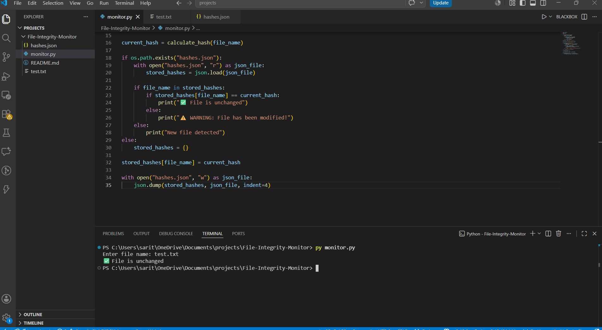
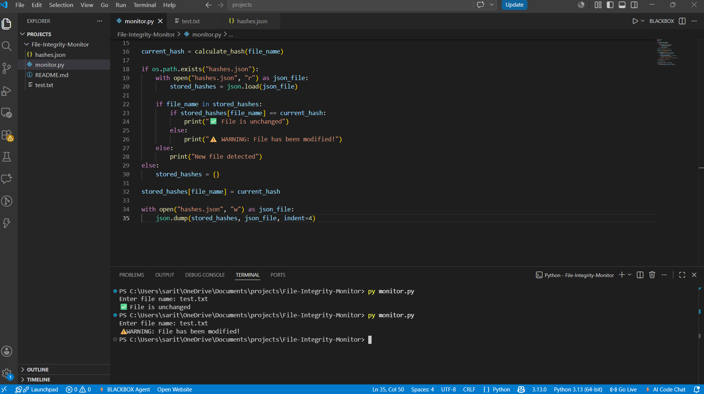
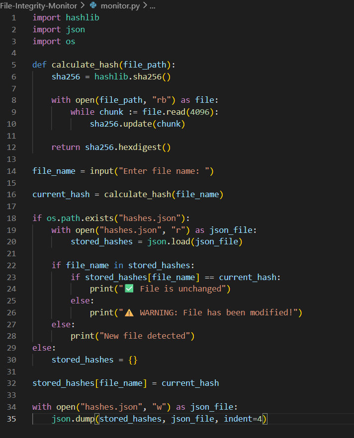

# File Integrity Monitor

A Python-based File Integrity Monitoring System that uses SHA-256 hashing to detect unauthorized file modifications.

## Features

- Generate SHA-256 hashes
- Store hashes in JSON format
- Verify file integrity
- Detect file tampering
- Alert when a file has been modified

## Technologies Used

- Python 3
- SHA-256 Hashing
- JSON

## Project Structure

```text
File-Integrity-Monitor
│
├── monitor.py
├── hashes.json
├── test.txt
├── README.md
└── Scrnshts
```

## How It Works

1. Calculate the SHA-256 hash of a file.
2. Store the hash in `hashes.json`.
3. Compare the current hash with the stored hash.
4. Display a warning if the file has been modified.

## Example Output

```
✅ File is unchanged
```

```
⚠️ WARNING: File has been modified!
```

## Author

Jayesh J


## Screenshots

### File Unchanged



### File Modified



### Source Code

