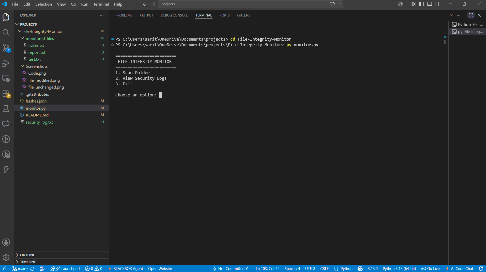
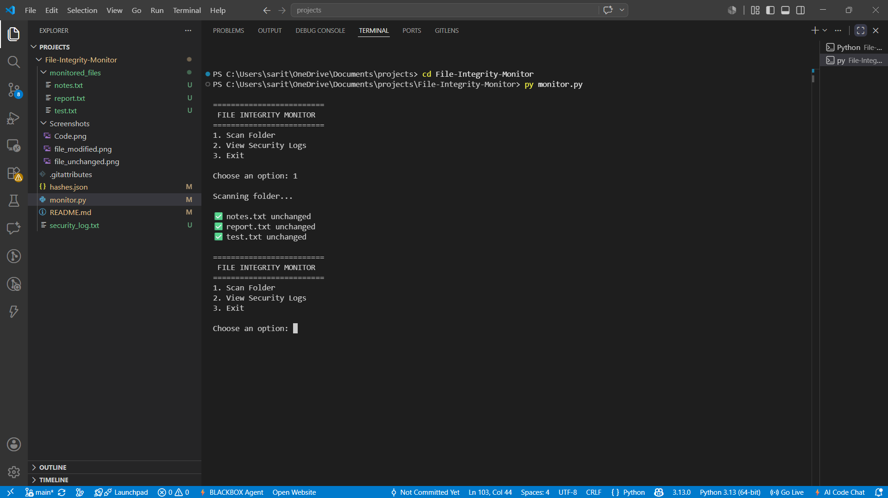
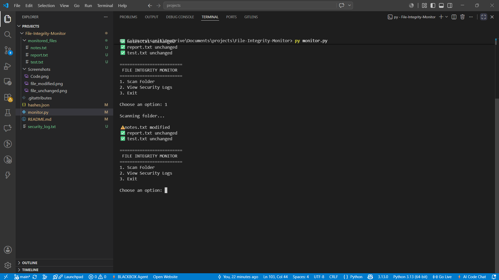
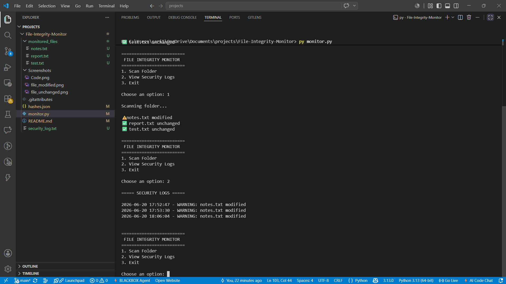
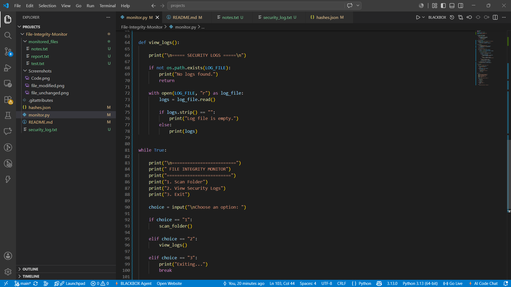

# File Integrity Monitor

A Python-based File Integrity Monitoring System that uses SHA-256 hashing to detect unauthorized file modifications and maintain file integrity.

## Features

- Generate SHA-256 hashes
- Monitor multiple files inside a folder
- Detect unauthorized file modifications
- Store hashes in JSON format
- Generate security logs with timestamps
- Menu-driven interface
- View security logs directly from the application
- Automatically update file hashes after scanning

## Technologies Used

- Python 3
- SHA-256 Hashing
- JSON
- File Handling
- OS Module
- DateTime Module
- Git
- GitHub

## Project Structure

```text
File-Integrity-Monitor
│
├── .gitignore
├── monitor.py
├── README.md
│
├── Screenshots
│   ├── main_menu.png
│   ├── folder_scan.png
│   ├── tamper_detection.png
│   ├── security_logs.png
│   └── source_code.png
│
└── monitored_files
    ├── notes.txt
    ├── report.txt
    └── test.txt
```

## How It Works

1. Scans all files inside the monitored_files folder.
2. Generates SHA-256 hashes for each file.
3. Compares current hashes with previously stored hashes.
4. Detects file modifications.
5. Records security events in a log file.
6. Allows users to view logs through a menu-driven interface.

## Menu Options

```text
=========================
 FILE INTEGRITY MONITOR
=========================

1. Scan Folder
2. View Security Logs
3. Exit
```

## Example Output

### Unchanged Files

```text
Scanning folder...

✅ notes.txt unchanged
✅ report.txt unchanged
✅ test.txt unchanged
```

### Modified File

```text
Scanning folder...

⚠️ notes.txt modified
✅ report.txt unchanged
✅ test.txt unchanged
```

## Security Log Example

```text
2026-06-20 17:52:47 - WARNING: notes.txt modified
2026-06-20 17:53:30 - WARNING: notes.txt modified
```

## Screenshots

### Main Menu



### Folder Scan



### Tamper Detection



### Security Logs



### Source Code



## Skills Demonstrated

- Python Programming
- Cybersecurity Fundamentals
- File Integrity Monitoring
- Cryptographic Hashing
- Security Event Logging
- Git Version Control
- GitHub Repository Management
- Problem Solving

## Future Improvements

- Real-time monitoring
- Email alert notifications
- GUI version using Tkinter
- Exportable security reports

## Author

Jayesh J

GitHub: https://github.com/Jayeshj12